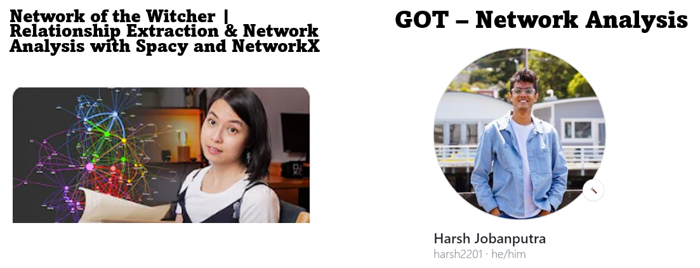

# Rick & Morty: A Social Network Analysis and Propagation Simulation
## Seasons 1 to 3

## Table of Contents
- About the Project
- Objective
- State of the Art
- Metodology
- Results
- Conclusion

## About the Project
The American adult animated television series "Rick and Morty," created by Justin Roiland and Dan Harmon in 2013 for Adult Swim, has captivated a wide audience with its unique blend of science fiction, humor, and exploration of human relationships. The series follows the misadventures of Rick Sanchez, an eccentric scientist, and his impressionable grandson, Morty, as they embark on adventures across dimensions, time, and intergalactic space. This repository presents a project that uses this series as inspiration to create a social network that reflects the relationships between its characters based on their interactions and dialogues in the first three seasons. Additionally, the article simulates the unexpected spread of a virus within this network, focusing on the intricately connected secondary characters within the network structure. The project illustrates how social network analysis techniques can be applied to understand relationships and patterns in a fictional context, combining elements of data science, narrative, and entertainment.

## Objective
The main objective of the project is to create a social network that reflects the relationships between the characters of "Rick and Morty" based on their interactions and dialogues in the first three seasons. Additionally, the spread of a virus is simulated within this network, focusing on the secondary characters connected within the network structure.

## State of the Art
In the context of this project, two notable works in social network analysis were taken as references. First, it was based on the video "Network of The Witcher — Relationship Extraction Network Analysis with Spacy and NetworkX" presented by Thu Vu, which explores the relationships between the characters of the "The Witcher" saga. The analysis uses centrality measures and community detection techniques to delve deeper into the interactions within the network. Second, inspiration was taken from the project "GOTNetwork Analysis" by Harsh Jobanputra, which created a network for the characters of the series "A Song of Ice and Fire" and simulated the spread of rumors based on independent cascades. This project also explored the relevance and importance of the characters throughout the saga using specific analysis methods.

  

## Methodology
### Dataset
The dataset is composed of three main variants: Source, Target, and Value. Source represents the characters with dialogues (speakers) in each episode of the first three seasons of "Rick and Morty". Target includes the characters mentioned in the dialogues of a speaker, while Value indicates the number of interactions between the speaker (source) and the mentioned character (target).

The dataset was obtained through web scraping from the website (http://rickandmorty.newtfire.org/transcripts.html) that hosted episode scripts from the first three seasons of "Rick and Morty". Natural language processing techniques were applied to label the characters mentioned in the dialogues. Subsequently, a network was built and centrality, closeness, intermediation, and eigenvector analyses were performed.

  

### Network Construction
The network was built using the NetworkX library from the Pandas edgelist containing the three variants (source, target, value) collected in the previous phase, especially the Edge attribute that represents the connections between nodes. The Kamada-Kawai layout algorithm was selected to visualize the graph in two or three dimensions, with the aim of distributing the nodes in a way that minimizes edge crossings and system energy.

  

### Analysis
#### Degree Centrality
The degree centrality of a node is the number of connections it has with other nodes in the network. Nodes with a high degree are considered central because they have many connections. Rick is the most central character in the "Rick and Morty" network, with the highest degree centrality (0.77). Morty, despite being the second main character, has fewer connections within the network (0.24). Surprisingly, Jerry has the second highest degree centrality (0.47) followed by Summer (0.37) and Beth (0.31).

#### Closeness Centrality
The Closeness Centrality is a measure that evaluates the relative importance of a node based on its accessibility and proximity to other nodes in the network. Rick has the best closeness (0.81) in the "Rick and Morty" network, indicating his high accessibility and proximity to other characters. The rest of the Smith-Sanchez family follows, with Jerry (0.65), Summer (0.61), Beth  (0.59), and Morty (0.56)in decreasing order.

#### Betweenness Centrality
Betweenness Centrality is a measure used in network analysis to evaluate the relative importance of a node as an intermediary in communication or information flows between nodes in the network. In the "Rick and Morty" network, Rick, Jerry, Summer, Beth, and Morty have the highest Betweenness Centrality, acting as important intermediaries in communication and information flows. Principal follows, with other secondary characters and Jessica trailing behind.

#### Eigenvector Centrality
Eigenvector centrality is a measure used in network analysis to evaluate the relative importance of a node based on its connections to other influential nodes in the network.In the "Rick and Morty" network, Rick, Jerry, Summer, Beth, and Morty have the highest eigenvector centrality, indicating their importance based on connections to influential characters. Goldenfold, Jessica, and Principal follow as the secondary characters with the best connections to the main characters.

  

### Communities
In order to create the communities within the Rick and Morty Network, the library Pyvis was used.  The visualization shows the nodes of the network, which represent the characters in the show, and the connections between the nodes, which represent the interactions between the characters. The size of each node is determined by its degree, which is the number of connections it has. The nodes are also colored by their community, which is a group of nodes that are closely connected to each other. Communities are groups of nodes that are closely connected to each other. They can be used to identify groups of characters that are likely to interact with each other frequently.

  

### Propagation
Once the analysis of degrees and communities is done, we can use an Independent Cascade (IC) model, which is a model used in network theory, especially in the field of information or influence propagation in social networks and diffusion systems. This model is used to simulate how influences, ideas, or information spread through a network of interconnected nodes.

#### Visualization
Once we have carried out the propagation of influence or information in the network, we move on to the visualization stage of the model which focuses on three particular characters: Jessica, Goldenfold, and Summer. During the visualization, interesting observations are made. In this context, we note that the propagation of influence or information requires a total of 5 iterations to affect practically all nodes in the network. This finding highlights the speed and reach of the diffusion, which can have significant implications for understanding how information spreads in this specific network and the effectiveness of diffusion or influence strategies that can be employed in this context.

If we want to go even deeper and get specific information about how long it takes for the whole family to get infected, we have done an analysis using the characters Goldenfold, Jessica and Principal as the central focus of our attention. In this more detailed perspective, we have observed an interesting result. Specifically, we have noticed that in just four iterations, the virus or influence manages to affect all members of the family. However, it is important to note that in this process, it does not spread to all nodes in the network in its entirety. This finding underscores the speed with which influence spreads within the family, while highlighting that the network as a whole may not be fully affected in this specific time period.

  

## Results
The analysis revealed several significant findings:

* Morty, despite being a central character, showed relatively lower centrality metrics compared to other family members. This could be because Morty, although a main character, is not the one who makes the decisions or has the most influence in the family.
* Jerry, considered less relevant in the family, surprisingly ranked second in network centrality. This could be because Jerry has connections with all other family members, making him an important point of contact in the network.
* The secondary character Goldenfold showed exceptional connectivity in the network. This could be because Goldenfold is a character who interacts with many other characters in the series, both inside and outside the Smith family.
* Principal, another secondary character, demonstrated importance in network centrality. This could be because Principal is an authority figure who has influence over students, including Morty.
* Jessica, despite being a secondary character, showed importance in eigenvector centrality. This could be because Jessica is a popular character who has many connections with other characters in the series.

These results highlighted the complexity of the character interactions in the "Rick and Morty" universe and their impact on network centrality. Additionally, they indicated that the importance of a character can differ from its relevance in the narrative.

## Conclusions

The project methodology involved the preparation of the dataset using web scraping, the construction of the network based on natural language processing, and the simulation of the propagation of a virus. This approach allowed for an innovative exploration of the interactions and patterns within the fictional universe of "Rick and Morty".

The simulation revealed that it took five iterations for the majority of the network to be affected by the virus, emphasizing the speed and reach of information diffusion within this specific network.

This study provides a foundation for future research on the structure and dynamics of social networks. The methods used in this project could be applied to other networks to better understand how information and influence spread.

Additionally, this study has the potential to be used to develop more effective marketing and communication strategies. By understanding how information spreads on social networks, businesses can develop more effective strategies to reach their target audience.
